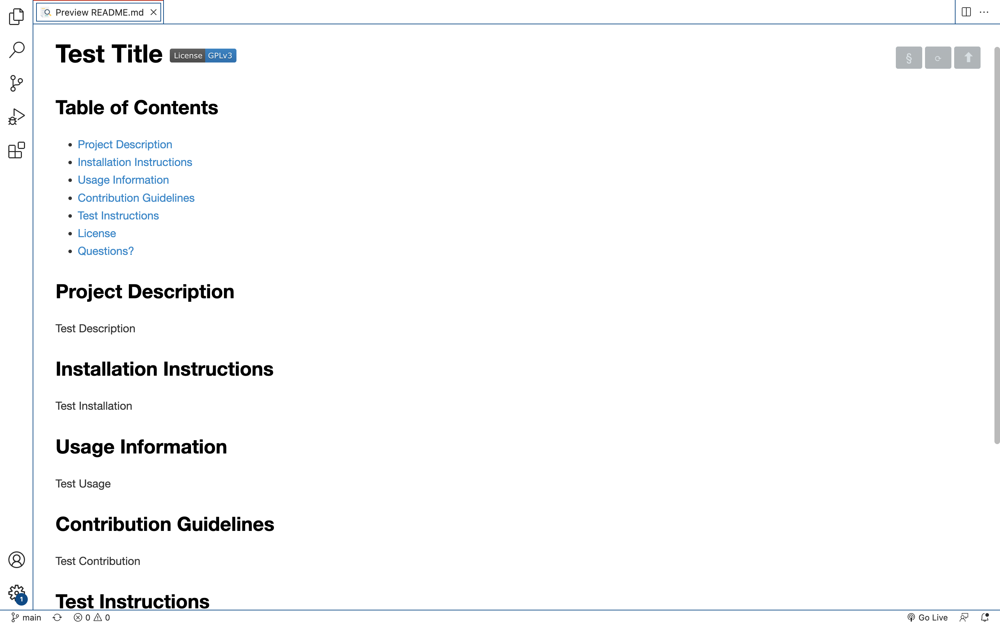
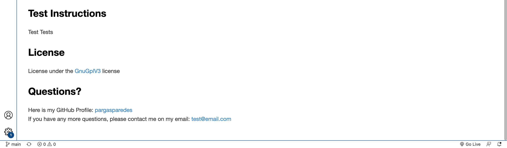
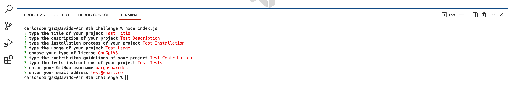

# README File Generator

## Table of Contents
- [Project Description](#project-description)
- [Installation Instructions](#installation-instructions)
- [Usage Information](#usage-information)
- [Questions?](#questions)

## Project Description
This project was created to generate README files from user's input.

## Installation Instructions
Open the command line, type "node index.js", press enter.
Link for the instructional video: [Video](https://drive.google.com/file/d/1xsqavKvGp66OZaStNh2_A4vpsHcRlubX/view)

## Usage Information
You will be presented with a series of prompts that will ask you questions about your project to populate the README file and generate it for you.

## Questions?
Here is my GitHub Profile: [pargasparedes](https://github.com/pargasparedes)
If you have any more questions, please contact me on my email: test@email.com

## Screenshots

